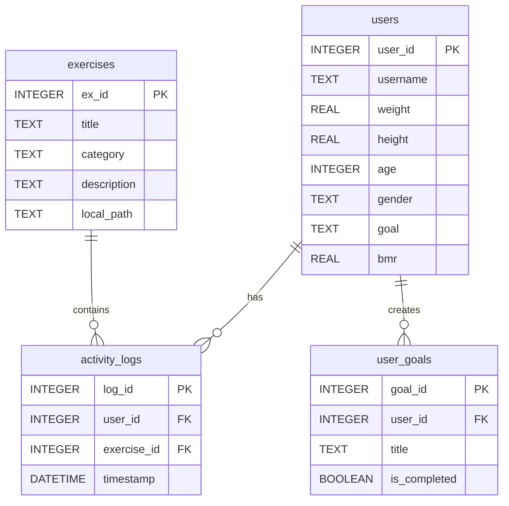

# ER Diagram

```mermaid
erDiagram

    users {
        INTEGER user_id PK
        TEXT username
        REAL weight
        REAL height
        INTEGER age
        TEXT gender
        TEXT goal
        REAL bmr
    }

    exercises {
        INTEGER ex_id PK
        TEXT title
        TEXT category
        TEXT description
        TEXT local_path
    }

    activity_logs {
        INTEGER log_id PK
        INTEGER user_id FK
        INTEGER exercise_id FK
        DATETIME timestamp
    }

    user_goals {
        INTEGER goal_id PK
        INTEGER user_id FK
        TEXT title
        BOOLEAN is_completed
    }

    users ||--o{ activity_logs : has
    exercises ||--o{ activity_logs : contains
    users ||--o{ user_goals : creates
```