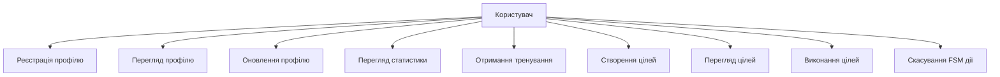

# Use Case Diagram

```mermaid
graph TD

    A[Користувач]

    A --> B[Реєстрація профілю]
    A --> C[Перегляд профілю]
    A --> D[Оновлення профілю]

    A --> E[Перегляд статистики]

    A --> F[Отримання тренування]

    A --> G[Створення цілей]
    A --> H[Перегляд цілей]
    A --> I[Виконання цілей]

    A --> J[Скасування FSM дії]
```